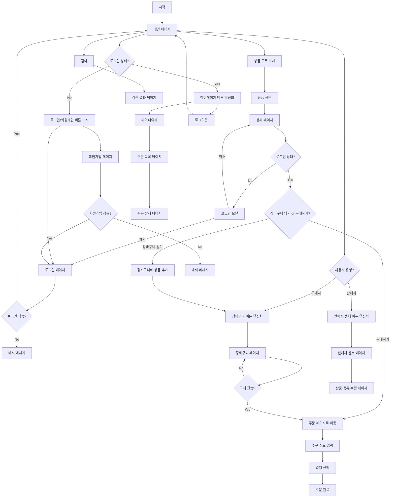
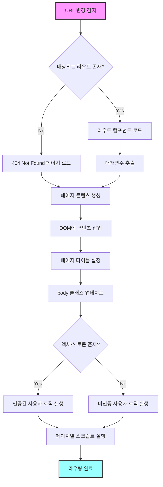

# Open Market Project

이스트소프트 오르미 2기 JavaScript 프로젝트

## 배포 주소

https://open-market-project.jihun.io/

## 1. 프로젝트 소개

이스트소프트 프론트엔드 개발자 오르미 2기의 JavaScript 프로젝트인 '호두샵' 오픈마켓 서비스입니다.

SPA(Single Page Application)로 제작하였으며, 필수 과제와 도전 과제를 포함하여 호두샵 백엔드 서버에서 제공하는 API를 모두 활용하여 실제 서비스되는 오픈 마켓 웹 페이지에 가깝게 구현하고자 하였습니다. 사용자 경험과 접근성 향상 또한 주요 목표로 삼아, 다양한 디바이스 환경에서도 일관된 경험을 제공하도록 노력했습니다.

## 2. 기술 스택

### - 프론트엔드

  

### - 배포 환경

 

## 3. 디렉토리 구조

```
📦Open-Market-Project
┣ 📂components
┃ ┣ 📜footer.js
┃ ┣ 📜header.js
┃ ┗ 📜sellerHeader.js
┣ 📂css
┃ ┣ 📂modules
┃ ┃ ┣ 📜_footer.scss
┃ ┃ ┗ 📜_header.scss
┃ ┣ 📂pages
┃ ┃ ┣ 📜_404.scss
┃ ┃ ┣ 📜_add.scss
┃ ┃ ┣ 📜_cart.scss
┃ ┃ ┣ 📜_dashboard.scss
┃ ┃ ┣ 📜_details.scss
┃ ┃ ┣ 📜_home.scss
┃ ┃ ┣ 📜_join.scss
┃ ┃ ┣ 📜_login.scss
┃ ┃ ┣ 📜_logout.scss
┃ ┃ ┣ 📜_mypage.scss
┃ ┃ ┣ 📜_order-details.scss
┃ ┃ ┣ 📜_order.scss
┃ ┃ ┗ 📜_purchase.scss
┃ ┣ 📜reset.css
┃ ┣ 📜style.css
┃ ┣ 📜style.css.map
┃ ┗ 📜style.scss
┣ 📂images
┃ ┣ 📜Logo-hodu.png
┃ ┣ 📜Union.svg
┃ ┣ 📜check-box.svg
┃ ┣ 📜check-fill-box.svg
┃ ┣ 📜icon-404.svg
┃ ┣ 📜icon-check-off.svg
┃ ┣ 📜icon-check-on.svg
┃ ┣ 📜icon-check.svg
┃ ┣ 📜icon-circle-off.svg
┃ ┣ 📜icon-circle-on.svg
┃ ┣ 📜icon-delete.svg
┃ ┣ 📜icon-down-arrow.svg
┃ ┣ 📜icon-fb.svg
┃ ┣ 📜icon-img.png
┃ ┣ 📜icon-insta.svg
┃ ┣ 📜icon-minus-line.svg
┃ ┣ 📜icon-plus-line.svg
┃ ┣ 📜icon-plus.svg
┃ ┣ 📜icon-radio-on.svg
┃ ┣ 📜icon-radio.svg
┃ ┣ 📜icon-right-arrow.svg
┃ ┣ 📜icon-search.svg
┃ ┣ 📜icon-shopping-bag.svg
┃ ┣ 📜icon-shopping-cart-2.svg
┃ ┣ 📜icon-shopping-cart.svg
┃ ┣ 📜icon-swiper-1.svg
┃ ┣ 📜icon-swiper-2.svg
┃ ┣ 📜icon-up-arrow.svg
┃ ┣ 📜icon-user-2.svg
┃ ┣ 📜icon-user.svg
┃ ┗ 📜icon-yt.svg
┣ 📂pages
┃ ┣ 📜add.js
┃ ┣ 📜cart.js
┃ ┣ 📜dashboard.js
┃ ┣ 📜details.js
┃ ┣ 📜home.js
┃ ┣ 📜join.js
┃ ┣ 📜login.js
┃ ┣ 📜logout.js
┃ ┣ 📜mypage.js
┃ ┣ 📜not-found.js
┃ ┣ 📜order.js
┃ ┣ 📜orderDetails.js
┃ ┣ 📜purchase.js
┃ ┗ 📜search.js
┣ 📂scripts
┃ ┣ 📜crypto-js.min.js
┃ ┣ 📜decryptingAccess.js
┃ ┣ 📜fingerprintjs-v4-life.min.js
┃ ┗ 📜router.js
┗ 📜index.html
```

## 4. 주요 기능

### 4.1. 메인 페이지


현재 호두샵에 등록된 상품 목록을 보여줍니다. 상품을 선택하여 상세 페이지로 이동할 수 있습니다. 

헤더에는 사용자가 로그인했을 경우 마이페이지 버튼이 활성화되며, 마이페이지 버튼을 클릭했을 때 드롭다운 박스가 표시되어 마이페이지와 로그아웃을 선택할 수 있습니다. 

구매자의 경우 장바구니 버튼이, 판매자의 경우 판매자 센터 버튼이 활성화됩니다.

### 4.2. 검색 페이지


검색어를 입력하여 검색 결과를 확인할 수 있습니다. 검색 결과는 상품 목록 페이지와 동일하게 표시됩니다.

### 4.3. 상세 페이지


상품의 이미지, 이름, 판매자, 배송비, 상품 금액을 확인할 수 있습니다. 

구매자는 상품을 장바구니에 담거나 구매할 수 있습니다. 

비로그인 사용자가 상품을 구매하거나 장바구니에 담으려고 할 경우 로그인 모달이 표시되며, 로그인 모달에서 확인 버튼을 클릭하여 로그인 페이지로 이동할 수 있습니다.


### 4.4. 로그인 페이지


이메일과 비밀번호를 입력하여 구매회원 및 판매회원으로 로그인할 수 있습니다. 

로그인에 성공하면 메인 페이지로 이동하고, 실패하면 에러 메시지가 표시됩니다.

### 4.5. 회원가입 페이지


이메일, 비밀번호, 이름, 전화번호, 판매자의 경우 사업자등록번호와 스토어 이름을 입력하여 구매회원 및 판매회원으로 가입할 수 있습니다. 

회원가입에 성공하면 로그인 페이지로 이동하고, 실패하면 에러 메시지가 표시됩니다.

### 4.6. 장바구니 페이지


장바구니에 담긴 상품을 확인할 수 있습니다. 

장바구니에 담긴 상품을 삭제하거나 선택하여 구매할 수 있고, 상품의 수량을 변경할 수 있습니다. 

장바구니 페이지에는 총 상품 금액과 배송비, 총 결제 금액이 표시됩니다. 

구매 버튼을 클릭하면 주문 페이지로 이동합니다.

### 4.7. 주문 페이지


주문자 정보와 배송지 정보를 입력할 수 있습니다. 

주문자 정보와 배송지 정보를 입력하고 결제 버튼을 클릭하면 주문이 완료됩니다.

### 4.8. 마이페이지


주문 목록 페이지와 회원 정보 수정 페이지(구현하지 않음)로 이동할 수 있는 링크를 제공합니다.

### 4.9. 주문 목록 페이지


주문한 상품의 요약 목록을 확인할 수 있습니다. 

해당 주문의 상세 정보 페이지로 이동할 수 있고, 주문 상태를 확인할 수 있습니다.


### 4.10. 주문 상세 페이지


주문한 상품들의 정보와 배송 정보, 결제 수단, 최종결제 정보를 확인할 수 있으며, 주문 취소 버튼을 클릭하여 주문을 취소할 수 있습니다.

### 4.11. 판매자 센터 페이지


현재 판매자 계정이 판매 중인 상품의 목록을 확인할 수 있습니다. 

판매 중인 상품을 수정하거나 삭제할 수 있으며, 상품 업로드 버튼을 클릭하여 상품을 새로 등록할 수 있습니다.

### 4.12. 상품 등록 페이지


상품을 새로 등록하거나, 기존 상품을 수정할 수 있습니다. 

상품의 이미지, 이름, 가격, 배송 방법, 배송비, 재고, 상품 상세 정보를 입력할 수 있습니다.



## 5. 기능 상세

### 5.1. SPA 라우터
웹 페이지의 경로에 따라 `pages/(페이지).js`를 렌더링합니다. 브라우저의 뒤로 가기, 앞으로 가기 버튼을 클릭하거나 주소를 직접 입력하여 페이지를 이동할 수 있습니다.



### 5.2. 로그인 상태
LocalStorage와 SessionStorage에 사용자 정보와 토큰을 저장하되, 액세스 토큰과 리프레시 토큰은 CryptoJS를 사용해서 암호화하여 저장합니다. 암호화에 사용되는 키는 FingerprintJS를 활용했습니다. 사용자 정보와 토큰을 저장하고 있는지 확인하여 로그인 상태를 판단합니다.

### 5.3. 우편번호 검색


우편번호 검색 API는 카카오의 주소 검색 API를 이용합니다. 상품 주문 페이지에서 우편번호 검색 버튼을 클릭하면 주소 검색 모달이 표시됩니다. 모달에서 주소를 검색하고 검색 결과를 선택하면 주문 페이지의 주소 입력 폼에 삽입됩니다.

### 5.4. 반응형 웹 디자인


https://github.com/user-attachments/assets/0a50fdc7-57e2-42b0-b66f-89281c1b68bc


미디어 쿼리를 사용하여 다양한 뷰포트 너비에 대응하는 반응형 웹 디자인을 구현했습니다. 또한, 일정 뷰포트 미만일 경우 헤더의 검색 창을 최소화하여 뷰포트의 공간을 효율적으로 활용했습니다.

## 6. 알려진 문제들

- 배포 환경에서 실행했을 때 불러오는 이미지의 용량이 커서 Lazy Loading을 적용했음에도 페이지 로드 속도가 다소 느립니다. React 프로젝트로 리팩토링하여 이미지 최적화를 진행하면 페이지 로드 속도를 개선할 수 있을 것으로 기대합니다.

- 시간 관계 상 크로스 브라우징을 완벽하게 구현하지 못했습니다. 특히 macOS와 iOS의 Safari에서는 일부 레이아웃이 Chromium 환경과 다르게 표시되는 문제가 있습니다.

- FingerprintJS의 브라우저 지문 생성 과정에서 일반적인 브라우징 환경에서 생성된 지문과 Chromium 개발자 도구의 '반응형 테스트 도구'의 브라우징 환경에서 생성된 브라우저 지문이 일치하지 않아 로그인 상태가 유지되지 않는 문제가 있습니다. 이 문제를 해결하기 위해 디바이스의 화면 해상도 값을 지문 생성 과정에서 제외하였지만, 그럼에도 불구하고 반응형 테스트 도구에서 특정 작업을 수행하면 로그인 상태가 유지되지 않는 문제가 존재합니다.

## 7. 개발을 통해 느낀 점

- 그간 토이 프로젝트로 간단한 웹 페이지들을 만들어 본 경험이 있지만, 실제 현업에서의 프로젝트와 유사하게 명세와 디자인대로 웹 페이지를 구현하는 것은 처음이었습니다. 저의 마음대로 만들어도 되는 토이 프로젝트와 달리 주어진 명세와 디자인을 따라야 하다 보니, 실무에서 개발할 때는 더욱 세심하게 여러 사항들을 고려하여 작업해야 한다는 것을 느꼈습니다.

- SPA로 웹 페이지를 개발하는 데 있어서 처음에는 라우터를 직접 개발하고 활용하는 것이 어려웠지만, 상품 목록과 같은 데이터들을 서버에서 불러와서 렌더링하는 것이 MPA로 개발할 때보다 오히려 더 쉬웠던 것 같습니다. 헤더나 푸터와 같은 공통 요소를 컴포넌트로 분리하여 재사용하는 것 또한 편리했습니다. 다만, 헤더나 푸터가 변하지 않고 메인 콘텐츠만 바뀌는 경우에도 페이지 전체를 다시 렌더링하는 점은 SPA의 장점을 적극 활용하지 못한 것 같아 아쉬움이 남습니다.

- Git으로 프로젝트의 버전을 관리하는 것이 중요하다는 점을 깨달았지만, 브랜치를 별도로 나누거나 커밋 메시지를 잘 작성하고, Git의 기타 고급 기능들을 활용하기에는 아직 미숙한 부분이 많다는 것을 느꼈습니다. 기회가 된다면 Git에 대해 더 자세히 배우고 싶다는 생각이 들었습니다.

- 작성된 코드가 제대로 작동되는지 확인하기 위해 QC를 진행하는 것이 쉽지 않았습니다. 특히, 상품 주문과 상품 등록 과정에서 반복적으로 폼을 작성하다 보니 큰 피로감을 느꼈습니다. 기회가 된다면 테스트 자동화 솔루션에 대해서도 공부하고 싶습니다.
